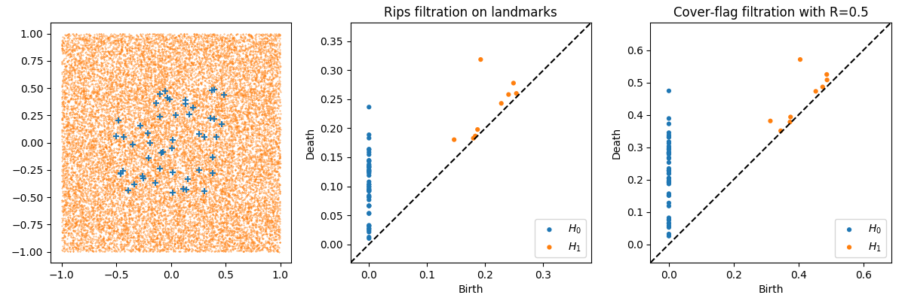
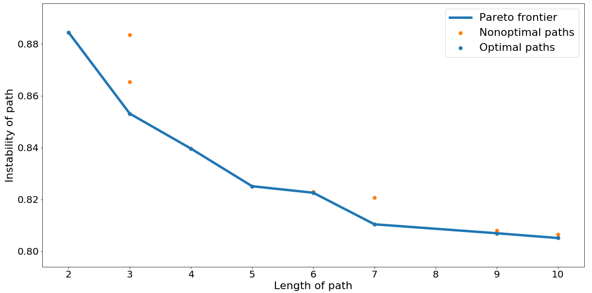
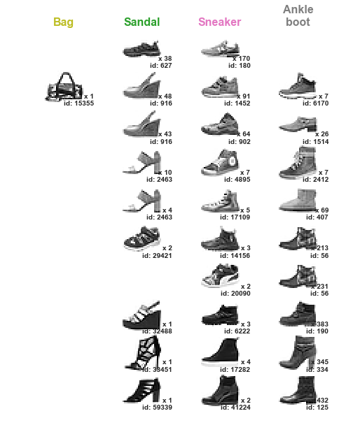
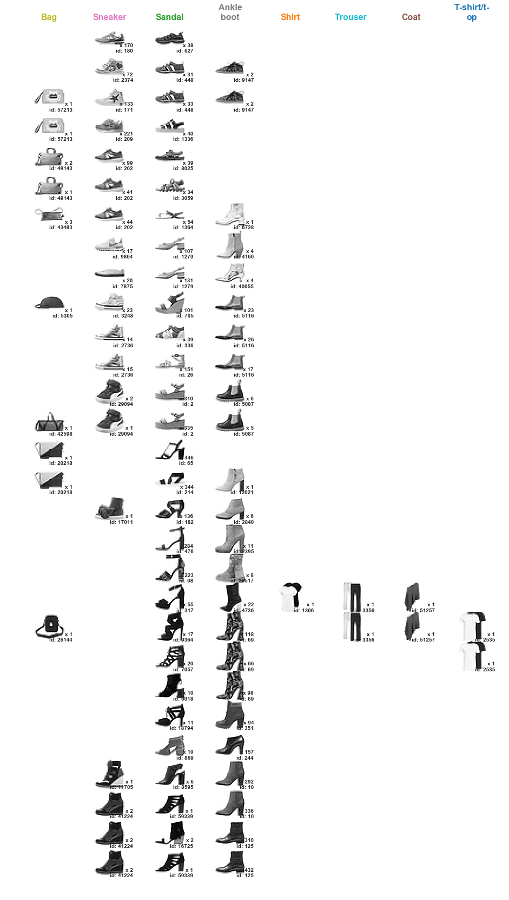

# Steinhaus Mapper

### Introduction

This repository includes the code for [Steinhaus Mapper and Stable Paths in the Mapper](https://arxiv.org/abs/1906.08256). It includes notebooks for several experiments addressed in that paper, included as separate sections below. 

### Requirements

These notebooks require the following packages:

  - os
  - pandas
  - hdbscan
  - matplotlib
  - mnist
  - networkx
  - numpy
  - seaborn
  - sklearn
  - umap
  - kmapper
  - scipy
  - itertools
  - time
  - paths
  - dionysus
  - ripser
  - cechmate

## Comparison of Cech and Cover Filtrations

A *filtration* of a point cloud is an attempt to understand the topology of the underlying space from which the cloud is sampled by constructing an evolving simplicial complex and noting the changes of the complex's topology as it evolves. This is a method often used in Topological Data Analysis (TDA). Standard filtration methods (Cech and V-R filtrations) build a complex by adding simplices based on nearness of points, relying on an underlying metric space. The cover filtration process creates a filtration of the nerve of a collection of sets by strength of overlap between sets. To situate the two in a comparable situation, we compare the Cech filtration for a collection of points with the cover filtration for the collection of sets formed by balls of radius (max distance between points)/2 around the same point cloud.

ComparisonofCechandCoverFiltrations is the code for section 4, Equivalence. It constructs both two-dimensional and three-dimensional Cech and cover filtrations from a random point set. To ease computational costs, we subsample the point sets and construct both filtrations, then compares the resulting structures. The goal of this section is to show the similarity of the (approximations of the) Cech and cover filtrations by comparing their persistence diagrams.

The notebook returns diagrams such as:

## Stable Paths and Recommendation Systems

Another tool of TDA, the Mapper algorithm, summarizes properties of a point cloud as a (hyper-)graph and studies the topology thereof. By considering the points mapped to each node in the Mapper as our base sets, we construct a Mapper from the cover filtration with weights on edges given by the strength of overlap between the two nodes that edge connects. This allows us to look at the persistence of paths when filtered by strength of overlap. In the use-case for section 6, the movie recommendation database, a path with high persistence would correspond with a collection of movies linked by having similar sets of recommenders. This information could be of use, for instance, to recommendation systems.

The code in MapperFashion trims the movie recommendation database down to movies with sufficiently many recommendations, then subsamples the remaining movies. Then a Mapper graph is constructed by assigning to each movie a set of users who recommended it sufficiently highly. By filtering on strength of connection, the code returns the most stable path from a source movie to a target movie for various lengths of path.

For instance, the system might return (depending on seed) the following paths from Mulan to Moulin Rouge:

## Stable Paths and Fashion MNIST

We perform a similar study on FashionMNIST, this time to study decision making in machine learning. We construct a Mapper on the probability predictions from a PCA predictor, then study the stability of paths in the Mapper. Highly stable paths should give us a gradient view of types of clothing (in this case, footwear) which the system considers similar.

We get output such as the following:

Each image represents a path, with sample sneaker, sandal, and ankle boot from each node. As we progress along the path, we can see gradual change in the general construction of shoe.
